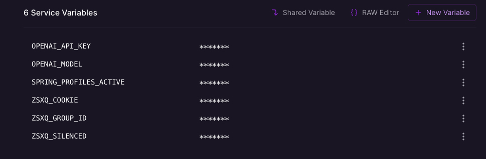

# chatgpt 聊天机器人

## 项目介绍

本项目是一个基于DDD(COLA)架构的聊天机器人，解耦业务逻辑与外部接口。并且使用了【策略模式】来为后续增加**支持平台**和**其他回答模型**提供拓展点。

代码运行演示：


知识星球演示：


## 一键启动

1. 修改`start`模块下的`application.yml`，或者通过**环境变量**的方式不用把密码硬编码在配置中
   * 修改open-ai的apikey
   * 修改知识星球的cookie
   * 修改知识星球的id

```yaml
spring:
  profiles:
    active: ${SPRING_PROFILES_ACTIVE:prod}
  task:
    scheduling:
      pool:
        size: 5
server:
  port: 8080
openai:
  model: ${OPENAI_MODEL:gpt-3.5-turbo}
  apiKey: ${OPENAI_API_KEY:你的apiKey}
zsxq:
  cookie: ${ZSXQ_COOKIE:你的星球cookie}
  groupId: ${ZSXQ_GROUP_ID:你的星球id}
  silenced: ${ZSXQ_SILENCED :true}
scheduler:
  list:
    - name: chatbotTask
      platform: zsxq
      answer: openai
      cron: '0/30 * * * * ?'
#    - name: demoTask
#      platform: demo
#      answer: demo
#      cron: '0/10 * * * * ?'
```

2. 运行`start`模块下的`Application`就可以开始定时任务的调度啦🎉

## 一键部署

[](https://railway.app/template/6-WHtb?referralCode=59QKWS)

点这个就可以复制我们模板一键部署到Railway上，最重要的是不用担心科学上网的问题！



## 架构设计

### 架构图


* Adapter层：负责任务调度（目前采用spring任务调度,可以随意切换成xxl-job等等）
* App层：由于没有复杂跨领域调用，所以空置。
* Domain层：负责核心领域对象的编排，不依赖于任务框(包括spring)。
* Infrastructure层：负责与外界API对接的具体技术细节实现。

### 核心领域建模

* `ChatBot`为聚合根负责每一个问答的核心业务逻辑包含一个`AnswerEngine`实体和`Platform`实体
* `AnswerEngine`实体负责根据提问对问题进行相应
* `Platform`实体负责从平台爬取问题并使用api进行回答


## 拓展开发

### 支持平台拓展


1. domain层增加一个`AnswerEngineType`枚举
2. infra层增加一个`AnswerEngine`实现类

### 支持回答模型拓展


1. domain层增加一个`PlatformType`枚举
2. infra层增加一个`Platform`实现类

## 欢迎交流
后续会根据逐步完善，欢迎大家提出宝贵意见，也欢迎大家提issue pr，还有点赞❤️。

可以加入星球使劲向我提问哈~


